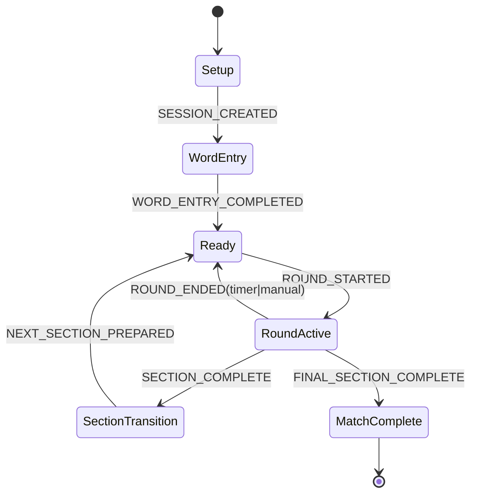

# Sprint 0.1 Completion: Product + Rules Modeling

This document completes Sprint 0.1 from `docs/SPRINT_PLAN.md`.

## Status

- Sprint: `0.1 - Product + Rules Modeling`
- Outcome: `Completed`
- Scope covered:
  - Rules interpretation spec
  - Domain glossary
  - Explicit game state model
  - State transition diagram
  - Edge-case policy decisions
  - Rule clarifications incorporated from implementation kickoff

---

## 1) Rules Interpretation Spec (from `GAME_RULES.md`)

### 1.1 Core match setup

- The game has exactly `2` teams.
- Player count must be at least `2` overall.
- Team sizes should be roughly balanced (soft rule).
- Each player submits `3` to `5` words.
- Words are intended to be things or verbs (guideline-first validation for MVP).

### 1.2 Match structure

- A match has `3` sections:
  1. Explain with words
  2. One word only
  3. Charades
- Each section is composed of alternating `1`-minute rounds between teams.
- The app tracks the active team, timer, bowl, and score.
- Players decide who holds the phone and gives clues for a round.
- On correct guess, the next word is drawn from the bowl.
- A section ends when the bowl has no remaining words.
- The same bowl word set is reused across sections.

### 1.3 Scoring and win condition

- `1` point per correctly guessed word.
- Track both section score and total score.
- Match winner is decided by total points across all `3` sections.
- If total points are tied, use sudden-death rounds until one team wins a full alternation cycle.

### 1.4 Rule constraints by section (for UI reminders and social enforcement)

- Section 1: verbal explanation allowed, no acting, sounds, or pointing.
- Section 2: clue must be exactly one word.
- Section 3: no speech or sounds; gestures and body language only.

### 1.5 Round-ending events

A round can end by:

1. Timer reaches `0`.
2. Player taps explicit `End round`.
3. The bowl is emptied by the final correct guess.

Rule violations are still socially enforced by players, but the app uses the same manual round-end action rather than a dedicated foul event.

---

## 2) Domain Glossary

- Match: full game from setup through winner.
- Section: one of the `3` rule modes.
- Round: one team's `60`-second turn window.
- Turn: the currently active team's timed play window.
- Bowl: pool of words available in the current section.
- Word state: queued, active, guessed, skipped.
- Foul: rule violation handled socially by players; the app does not store a dedicated foul reason.

---

## 3) Proposed Game State Model (implementation-facing)

```ts
export type SectionId = 1 | 2 | 3;

export type MatchPhase =
  | 'setup'
  | 'word_entry'
  | 'ready'
  | 'round_active'
  | 'section_transition'
  | 'match_complete';

export interface Team {
  id: string;
  name: string;
  totalScore: number;
}
```

Full implementation lives in `lib/game-engine/types.ts`.

---

## 4) State Transition Diagram



---

## 5) Edge-case Policy Decisions (Sprint 0.1, finalized)

1. Skip handling
   - Skipped word re-enters immediately.
   - It is shuffled into the remaining pool.
   - Guarantee at least one different word before it appears again.

2. Order randomization
   - Bowl order is reshuffled between rounds.

3. Last-word + timer boundary
   - If `Guessed` is registered before the timer-end event, count it.
   - If the timer event is processed first, the word does not count.

4. Team balancing
   - Imbalance warning is non-blocking.
   - Hard block only on invalid minimum requirements.

5. Word validation strictness
   - Apostrophe words count as one token: `don't`
   - Hyphenated words count as two tokens: `ice-cream`
   - Multi-word phrases are invalid.
   - "Thing/verb" remains guidance-level in MVP.

6. Foul behavior
   - No dedicated foul button or typed foul reason UX.
   - Players enforce verbally; app uses the normal manual round-end action.

7. Section score visibility
   - No separate round-summary screen is required.
   - Section totals should be visible during section transitions and in final results.

---

## 6) Sprint 0.1 Definition of Done Check

- [x] Rules translated into concrete domain entities.
- [x] Valid game states and transitions documented.
- [x] Edge-case policy decisions documented.
- [x] State-transition diagram added.
- [x] Glossary added.
- [x] Rule clarifications from implementation kickoff captured.

Sprint 0.1 exit criteria satisfied. Ready to execute Sprint 0.2.
